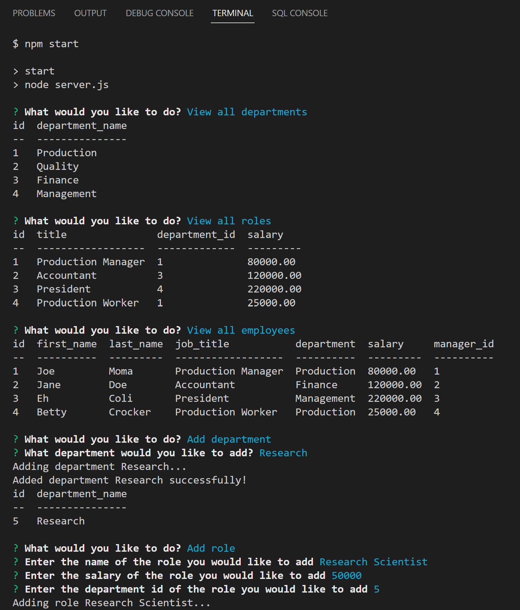
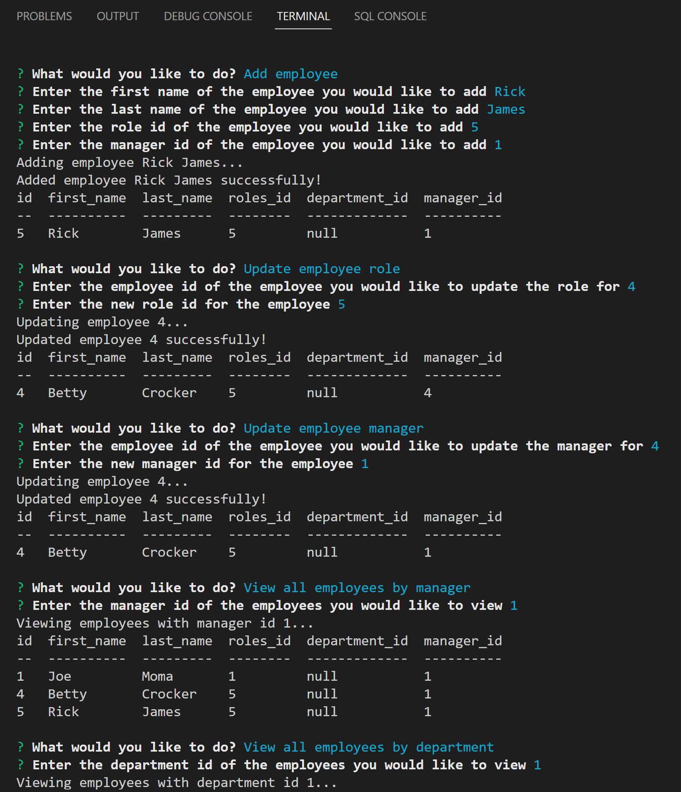
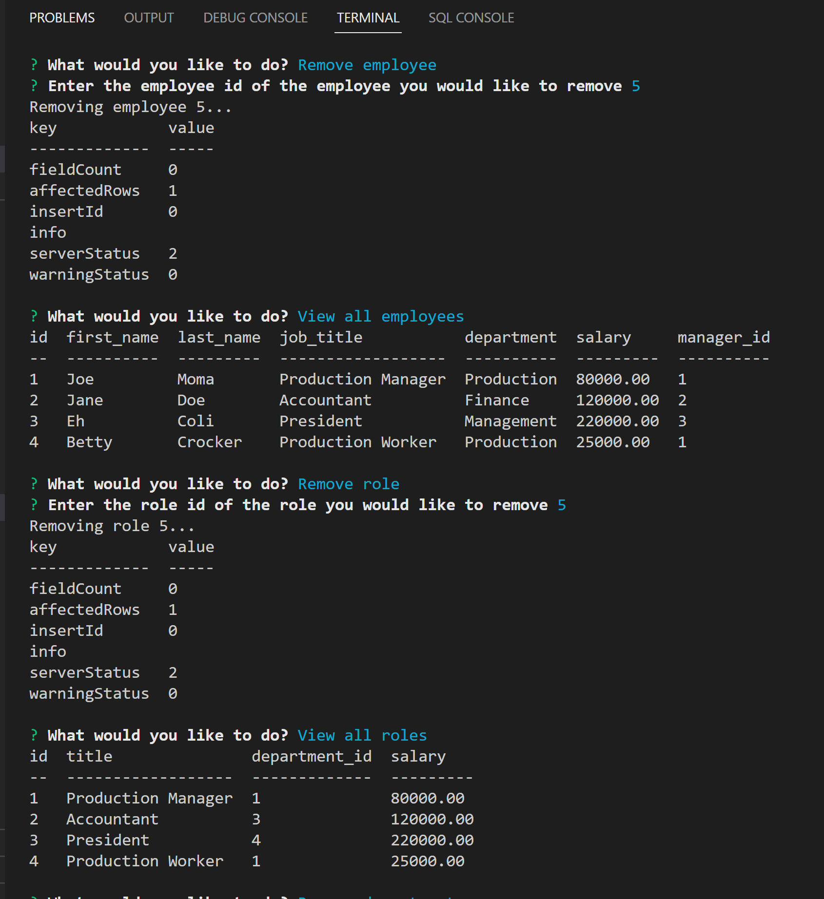
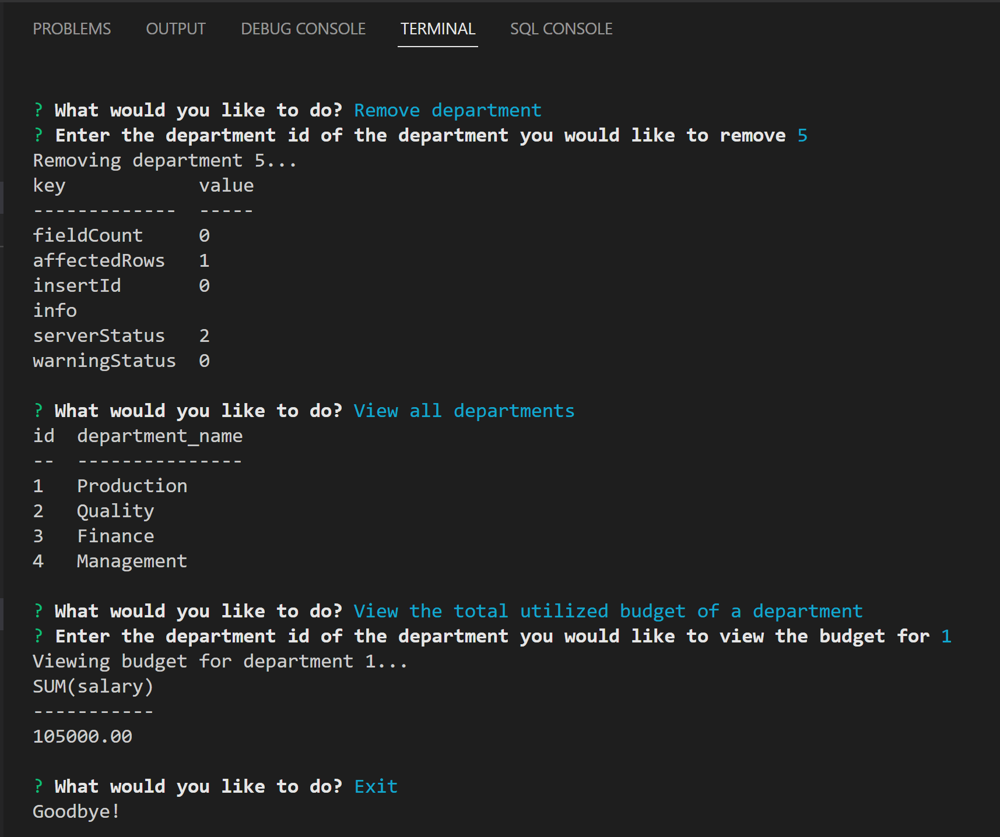

  # mySQL Employee Tracker
  
  
  

  ## Description
  A content management system that allows users to view and interact with the employee database via the command-line.

  ## Table of Contents
   - [Description](#Description)
   - [Installation](#Installation)
   - [Usage](#Usage)
   - [License](#License)
   - [Contributing](#Contributing)
   - [Tests](#Tests)
   - [Questions](#Questions)

  ## Installation
  Must utilize Node.js and require Inquirer (version 8.2.4)  and MySQL.

  ## Usage
  Start with creating a .env file to update MySQL connection username and password, npm install and npm start to intialize application.
  Link to screen recording of funcional application: https://drive.google.com/file/d/1djlYROH2pCBwfFgAmXxnMVHKKtyBymqt/view
  <iframe src="https://drive.google.com/file/d/1djlYROH2pCBwfFgAmXxnMVHKKtyBymqt/preview" width="640" height="480"></iframe>

  First five rompts:

  
  Next set of five Prompts:

  Remove Employee and Roles:

  Remove Department and Total Budget of Department:

  ## License 
  
  

  This application is covered by the MIT license.
  
  ## Contributing
  Suggestions are always welcomed.

  ## Tests
  not applicable

  ## Questions
  Link to GitHub profile: https://github.com/keberlea
  
  If you have questions you can reach me by email at the following address: alicia.keberle@gmail.com
  